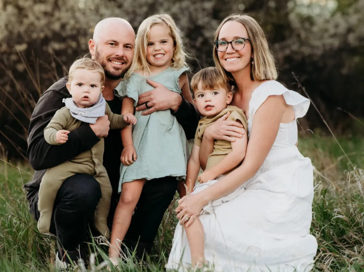

## Welcome to Our Church Family

We are a new church plant committed to proclaiming the Gospel of Jesus Christ in the beautiful coastal communities of North County San Diego.

Whether you're exploring faith for the first time or seeking to serve Christ by serving His church, you belong here. Come as you are and discover how God's grace transforms lives and community.

---

## Our Pastor

### Rev. M. Connor Underseth - Planting Pastor

Rev. M. Connor Underseth is a native San Diegan who grew up in Carlsbad. He discovered Reformed theology as a history major in college and has never looked back. Connor is a graduate of San Francisco State University (B.A. History) 2014, Westminster Seminary California (M.A. Biblical Studies) (M.A. Theological Studies) 2018, and is currently working on a ThM in Historical Theology at Puritan Reformed Theological Seminary. His research is focused on ecclesiology in the post-Reformation era.

Prior to serving at All Saints Presbyterian Church, Connor served first as the Assistant Pastor, then Associate Pastor at New Life Presbyterian Church of La Mesa from 2020 to 2025. He also served as the Stated Clerk of the South Coast Presbytery (PCA) from 2023-2025.

He and his wife Danielle have three young children, and enjoy going to the beach and spending time with family and friends. Connor also enjoys surfing and is an avid home cook.

**Email:** [connor@aspchurch.com](mailto:connor@aspchurch.com)

---

## Our Church Plant Story

All Saints Presbyterian Church began as a vision to bring Reformed worship and biblical teaching to the growing communities of North County San Diego. As a church plant in the Presbyterian Church in America (PCA), we are committed to:

- **Expository Preaching** - Faithful exposition of God's Word
- **Reformed Worship** - Historic Christian liturgy and practice
- **Community Fellowship** - Building authentic relationships
- **Gospel Mission** - Sharing Christ's love in North County

---

## What to Expect

### First-Time Visitors
- **Warm Welcome** - You'll be greeted with genuine hospitality
- **Casual Dress** - Come as you are, no dress code required
- **Biblical Worship** - Reverent yet accessible service format
- **Childcare Available** - For children ages 1-6 during service

### Our Service
- **Time:** Sunday Evenings at 5:00 PM
- **Location:** Redeemer By The Sea Lutheran Church
  6600 Black Rail Rd, Carlsbad CA 92011
- **Duration:** Approximately 1 hour and 15 minutes
- **Style:** Traditional Reformed liturgy with contemporary relevance

---

## Get Connected

We'd love to meet you! Here are ways to connect with our church family:

**Sunday Worship**
Join us Sunday evenings at 5:00 PM for worship, fellowship, and community.

**Pastor Connor**
Email: [connor@aspchurch.com](mailto:connor@aspchurch.com)
Feel free to reach out with questions or to schedule a coffee conversation.

**Serve With Us**
There are many opportunities to serve Christ by serving His church. From hospitality to children's ministry, find your place in our community.

**Stay Updated**
Follow us on [Instagram](https://www.instagram.com/allsaintspresbyterianchurch/) for updates and community highlights.

---

*We believe that God's grace transforms lives and community. Whether you're exploring faith for the first time or looking for a church home, you're welcome here.*